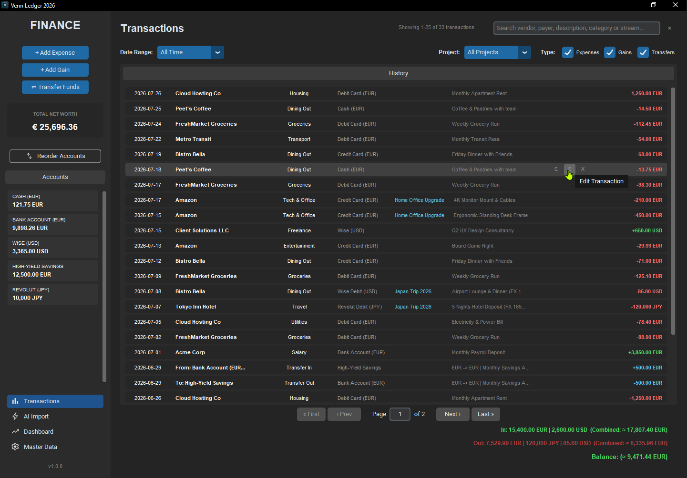
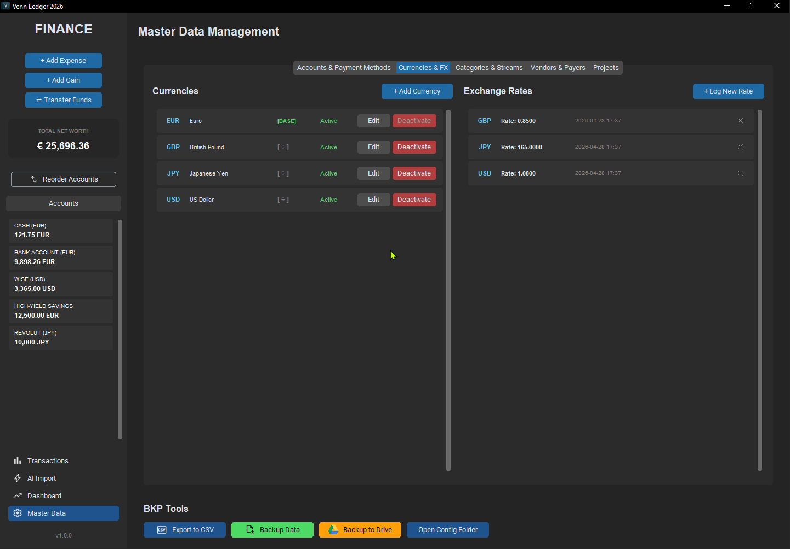
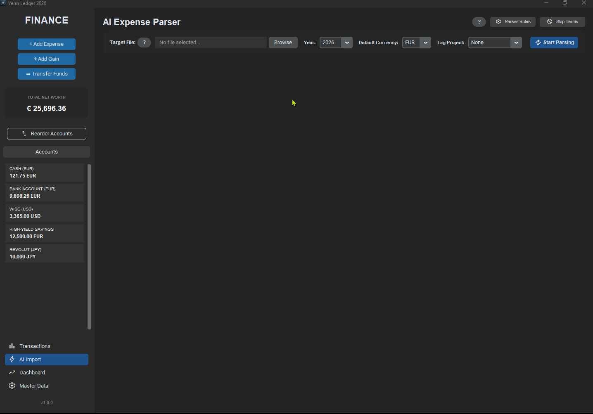

<!-- Hero Image (Full Width) -->
<br>

<!-- Supporting Images (Side-by-Side) -->
<p align="center">
  
  
</p>

# VennLedger

**A powerful, privacy-first desktop finance tracker engineered for the modern power user.** 

VennLedger combines the security of local data storage with the cutting-edge capabilities of local Large Language Models (LLMs). Effortlessly parse raw financial journals into structured data, manage complex multi-currency portfolios with historical exchange rates, and secure your financial history with automated, encrypted Google Drive backups—all without compromising your privacy.

---

## 🚀 Key Features

*   🧠 **Advanced AI Expense Parser (Local LLM):** Say goodbye to manual data entry. VennLedger integrates with Ollama to run `mistral:7b` locally, intelligently parsing unstructured text (like daily expense journals) into structured, database-ready JSON objects.
*   💱 **Multi-Currency & Historical FX:** Native support for handling multiple fiat and crypto currencies. Features a robust exchange rate engine that fetches historical FX rates based on transaction timestamps, ensuring your Net Worth is always accurately calculated in your Base Currency.
*   🔒 **Uncompromising Local Privacy:** Your financial data is yours. Everything is stored in a local SQLite database (`tracker.db`) using Write-Ahead Logging (WAL) for high performance and reliability. No telemetry, no third-party cloud databases.
*   ☁️ **Google Drive ZIP Backups:** Seamlessly backup your entire database and configuration state. VennLedger packages your data into a compressed ZIP archive and uploads it directly to your personal Google Drive via OAuth 2.0.
*   📊 **Interactive Financial Dashboard:** Visualize your cash flow, expense breakdowns, and net worth trends with dynamic, hover-responsive Matplotlib charts embedded directly into the CustomTkinter UI.
*   ⚙️ **Dynamic Master Data Management:** Fully customizable Categories, Payment Methods, Vendors, Payers, Streams, and Projects.
*   📝 **Comprehensive Ledger Management:** Intuitive data grids to manually add, edit, duplicate, and delete expenses, incomes, and account transfers with ease.

---

## 🛠️ Tech Stack

VennLedger is built on a robust, modern Python stack:

| Component | Technology / Library | Description |
| :--- | :--- | :--- |
| **GUI Framework** | `customtkinter` | Modern, dark-mode-first desktop UI components. |
| **Database ORM** | `SQLAlchemy` (v2.0+) | High-performance SQLite database interactions and schema management. |
| **AI Integration** | `ollama` | Python client for local LLM execution (Mistral 7B). |
| **Data Visualization**| `matplotlib` & `mplcursors` | Interactive financial charting and trend analysis. |
| **Cloud Backup** | `google-api-python-client` | Google Drive API integration for secure ZIP uploads. |
| **Date Handling** | `tkcalendar` | Interactive date-picker widgets for transaction logging. |

---

## 🛑 Prerequisites (Local AI Engine)

Before using the AI Parser, you **must** have Ollama installed and the required AI model pulled to your local machine. The parsing features will fail gracefully if the Ollama daemon is not running.

### For Windows Users
1. Download and install [Ollama Desktop](https://ollama.com/).
2. Open your **Command Prompt** and run the following command to download the model:
   ```cmd
   ollama pull mistral:7b
   ```
3. Ensure the Ollama icon is running in your System Tray before launching VennLedger.

### For Linux / Steam Deck Users
1. Open your **Terminal** (or Konsole in Desktop Mode) and run the official install script:
   ```bash
   curl -fsSL [https://ollama.com/install.sh](https://ollama.com/install.sh) | sh
   ```
2. Download the required model by running:
   ```bash
   ollama pull mistral:7b
   ```
3. Leave the service running in the background.

---

## 📥 Download & Install

You don't need to install Python to run VennLedger. Standalone executables are available for Windows and Linux.

1. Go to the **[Releases](../../releases)** page.
2. **Windows:** Download `VennLedger_Setup_v1.0.0.exe` and run the installer.
3. **Linux / SteamOS:** Download `VennLedger_Linux_v1.0.0.zip`, extract the file, and ensure it has executable permissions (`chmod +x VennLedger-Linux`). 

*(Note: On the very first run, VennLedger will guide you through a First-Run Wizard to set up your Base Currency and initial account balances).*

---

## 💻 Installation (Build from Source)

Follow these steps if you prefer to run VennLedger in your local development environment:

**1. Clone the repository:**
```bash
git clone https://github.com/Venn77/venn-ledger.git
cd VennLedger
```

**2. Create and activate a virtual environment:**
```bash
# Windows
python -m venv venv
venv\Scripts\activate

# macOS/Linux
python3 -m venv venv
source venv/bin/activate
```

**3. Install the required dependencies:**
```bash
pip install -r requirements.txt
```

**4. Launch the application:**
```bash
python main_app.py
```
*(Note: On the very first run, VennLedger will guide you through a First-Run Wizard to set up your Base Currency and initial account balances).*

---

## ☁️ Google Drive Setup

To enable the **Backup to Drive** feature, you must provide your own Google Cloud OAuth 2.0 credentials. 

*Need a visual guide? Read Google's official [Desktop App Credentials Guide](https://developers.google.com/workspace/guides/create-credentials#desktop-app).*

1. Go to the [Google Cloud Console](https://console.cloud.google.com/) and click **Create Project**.
2. Go to **APIs & Services > Library**, search for **Google Drive API**, and click **Enable**.
3. Go to **APIs & Services > OAuth Consent Screen**:
   - Choose **External** and click Create.
   - Fill in the required fields (App Name, User Support Email, Developer Contact).
   - **Crucial Step:** Under the **Test Users** section, click **Add Users** and enter your own Gmail address. *(If you skip this, Google will block your login later!)*
4. Go to **APIs & Services > Credentials**:
   - Click **Create Credentials** > **OAuth client ID**.
   - Select **Desktop app** as the Application type and click Create.
5. Click the **Download JSON** button and rename the downloaded file to exactly `credentials.json`.
6. Open VennLedger, navigate to the **Master Data** (Settings) tab, and click **Open Config Folder**.
7. Move your `credentials.json` file into this folder.
8. Click **Backup to Drive** in the app. A browser window will open asking you to authorize the app. Once authorized, a `token.json` will be generated automatically for future seamless backups.

---

## 🤖 AI Journal Format & Customization

VennLedger's AI parser expects a specific daily journal format to accurately extract your transactions.

### The Text Format
**Date Headers:** Each day MUST start with `DD/MM:` or `DD/MM (note):`

**Transaction Lines:** `[Category] [Vendor] [Amount] [Currency?] [Method] [Description]`

**Foreign Currency & Custom Rates:**
Add a currency code after the amount to auto-fetch historical rates. To force a custom rate, include `FX [rate]` in the description.

**Example Journal:**
```text
09/07 (Japan Trip Planning):
Travel Tokyo Inn Hotel 120000 JPY revolut 5 Nights Hotel Deposit (FX 165.0)

10/07:
Dining Out Bistro Bella 85 USD wise Airport Lounge & Dinner (FX 1.08)
Groceries FreshMarket Groceries 98.30 debit Weekly Grocery Run

15/07:
Tech & Office Amazon 450 credit Ergonomic Standing Desk Frame
Entertainment Amazon 29.99 credit Board Game Night

17/07:
Tech & Office Amazon 210 credit 4K Monitor Mount & Cables

19/07:
Dining Out Peet's Coffee 13.75 cash Coffee & Pastries with team

24/07 (Standard Errands):
Transport Metro Transit 54 debit Monthly Transit Pass
Groceries FreshMarket Groceries 88.90 debit Weekly Grocery Run

26/07:
Dining Out Bistro Bella 68 credit Friday Dinner with Friends

28/07:
Housing Cloud Hosting Co 1250 debit Monthly Apartment Rent
```

---

## ⚙️ Tailoring the AI to Your Database

To achieve 100% parsing accuracy, the AI must be configured to recognize your custom Master Data. 

Navigate to the **AI Import** tab in VennLedger to customize the parser:

*   **Parser Rules:** Click the ⚙️ icon to open `ai_prompt_template.txt`. Here, you can edit the `<mapping_table>` and `<examples>` to perfectly match your database. For instance, if your database uses "Amex Card" instead of "Credit Card", update the mapping table so the LLM outputs the exact string VennLedger expects.
*   **Skip Terms:** Click the 🚫 icon to open `ai_skip_terms.txt`. Add keywords (one per line) like `Transfer`, `Withdrawal`, or `Ignore`. The parser will completely bypass any line in your raw text file starting with these words, saving processing time and preventing hallucinated transactions.

---

## 🛡️ Data Privacy Statement

**Your finances are strictly confidential.** 
VennLedger is architected with a local-first philosophy. 
* All financial records, master data, and configurations are stored locally on your machine in a SQLite database. 
* The AI Expense Parser utilizes Ollama to process your data locally—**no financial data is ever sent to OpenAI, Anthropic, or any external API.** 
* Network requests are only made if you explicitly trigger a Google Drive backup, which securely transfers an encrypted ZIP directly to your personal Google account.
